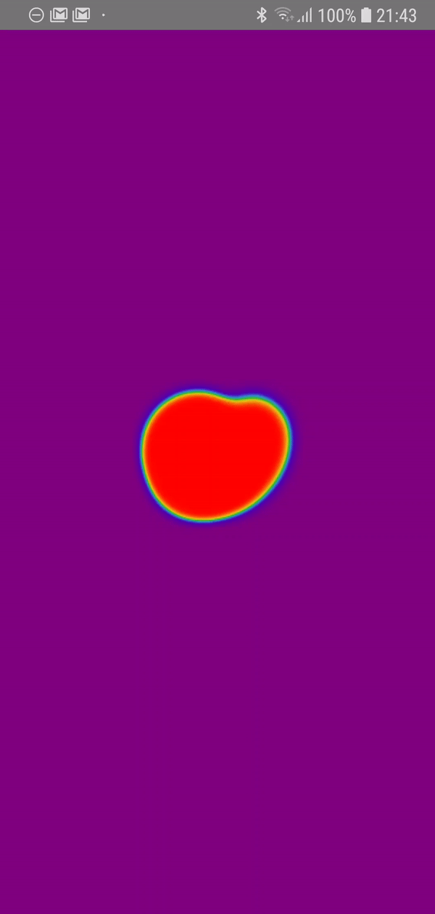

# react-native-simpleheat
The awesome [simpleheat.js](https://github.com/mourner/simpleheat), bound to React Native.

<p align="center">
  
</p>

## 🚀 Getting Started

Using [npm]():

```sh
npm install --save react-native-simpleheat
```

Using [yarn]():

```sh
yarn add react-native-simpleheat
```

## ✍️ Example

This library exports a single `Component`, the `Heatmap`, which is essentially a React Native `<WebView/>` component that is pointed at a dynamic webpage which renders a full-screen heatmap. The heatmap is rendered using [Vlad's](https://github.com/mourner) awesome [`simpleheat.js`](https://github.com/mourner/simpleheat), which is quick, pretty and has a permissive distribution license.

```javascript
import React from 'react';
import {
  PanResponder,
  View,
  Text,
  TouchableOpacity,
  Alert,
} from 'react-native';
import WebView from 'react-native-webview';

import Heatmap from 'react-native-simpleheat';

export default class App extends React.Component {
  state = {
    // XXX: This is a simple example of taking multi-touch gestures from the PanResponder
    //      and using these to drop points on the heatmap.
    panResponder: PanResponder
      .create(
        {
          onStartShouldSetPanResponder: () => true,
          onMoveShouldSetPanResponder: () => true,
          onPanResponderMove: ({ nativeEvent }) => {
            const { changedTouches } = nativeEvent;
            const { heatmap } = this.refs;
            this.setState(
              {
                data: [
                  ...this.state.data,
                  ...changedTouches
                    .map(
                      ({ locationX, locationY }) => {
                        return [
                          locationX,
                          locationY,
                          10,
                        ];
                      },
                    ),
                ],
              },
            );
          },
          onPanResponderRelease: () => this.setState({
            data: [],
          }),
        },
      ),
    data: [],
    gradient: undefined, // <-- Here you could use a custom gradient.
  };
  render() {
    const {
      panResponder,
      data,
      gradient,
    } = this.state;
    return (
      <View
        style={{
          backgroundColor: 'purple', // <-- HeatMap is transparent, so you can view what's underneath.
          flex: 1,
        }}
      >
        <Heatmap
          ref="heatmap"
          {...panResponder.panHandlers} // <-- extraProps are delegated to the containing <Animated.View/>
          WebView={WebView} // <-- Implementors must define the <WebView/> component!
          data={data}
          gradient={gradient}
          alpha={0.5} // <-- Control transparency for overlays!
        />
      </View>
    );
  }
}
```

## 🌎 Maps

If you specify a `region` prop to the `<Heatmap/>`, the points in your data prop will be treated as `latitude` and `longitude` coordinates. For  example, the configuration below would render intensity over Liverpool, UK.

```javascript
import React from 'react';
import WebView from 'react-native-webview';
import Heatmap from 'react-native-simpleheat';

export default () => (
  <Heatmap
    WebView={WebView}
    region={{
      latitude: -3.0118499,
      longitude: 53.4139281,
      latitudeDelta: 1,
      longitudeDelta: 1,
    }}
    data={[
      [
        53.4139281, // longitude
        -3.0118499, // latitude
        10, // intensity
      ],
    ]}
  />
);
```

## 📌 Props

Prop                  | Type     | Default                   | Required
--------------------- | -------- | ------------------------- | --------
WebView|func||Yes
pointerEvents|string|'box-only'|No
containerStyle|shape[object Object]|styles.containerStyle|No
max|number|10|No
gradient|shape[object Object]|{ /* see code */ }|No
onLoadEnd|func|e => null|No
data|array|[]|No
minOpacity|number|0.05|No
alpha|number|1.0|No
region|shape|null|No

## ✌️ License
[MIT](https://opensource.org/licenses/MIT)
